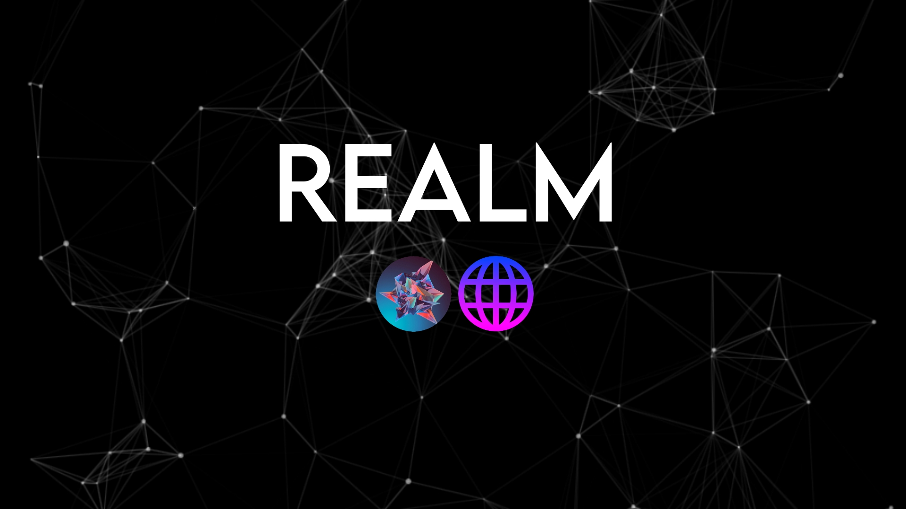

<kbd>

</kbd>

<h1>Realm Services</h1>

### About
We are an organization dedicated at providing quality services to get around internet and VPN blocks.
- Open Source - We believe everyone deserves to have access to the code to prevent shady activities.
- AD-Free - We believe ads ruin the clean user experience. Our projects will **NEVER** include ads.
- Quality (not on 3kh0-x RTM) - We believe that our projects **MUST** look good to the eye.

**NOTE: Affiliated projects (Not by Realm Services) may include ads.**

### Projects
- [3kh0 X](https://github.com/kaio-lord/website-x/) - Flagship project of Realm Services - The ultimate unblocked games site on the planet.
- [uv-3kh0](https://github.com/Realm-Services/uv-3kh0/) - Fork of Metallic. - UV Bare server for 3kh0.
- [GΛLΛXIΛ](https://github.com/Realm-Services/) - New project aimed to release in early 2025.
- [3kh0 v5 static](https://github.com/Realm-Services/v5-static/) - 3kh0 v5 ported to static.

### Affiliated Projects (via EchoDev)
- [3kh0 v5, by Silvereen](https://github.com/Echo-Dev-Labs/3kh0v5) - 3kh0 release made by Silvereen. non static.
- [3kh0 Lite](https://github.com/3kh0/3kh0-lite/) - Lightweight fork of 3kh0 v3.

### Developers
- [kaio-lord](https://github.com/kaio-lord/) - Owner
- Anyone wishing to join Realm Services must contact divinelordkaio on Discord.
